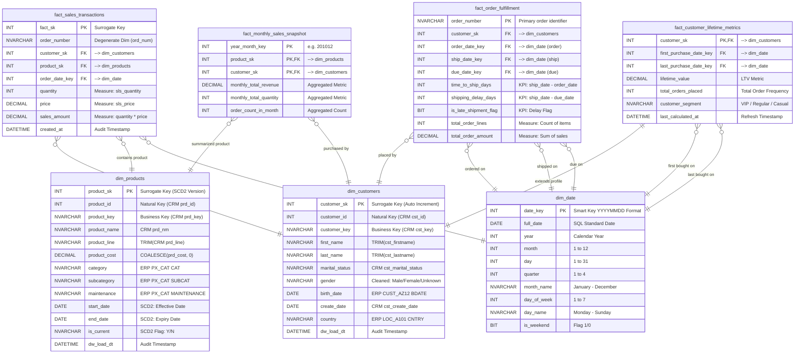

```mermaid
erDiagram
    %% ==========================================
    %% DIMENSION TABLES (Các bảng Danh mục cốt lõi)
    %% ==========================================
    dim_customers {
        INT customer_sk PK "Surrogate Key (Auto Increment)"
        INT customer_id "Natural Key (CRM cst_id)"
        NVARCHAR customer_key "Business Key (CRM cst_key)"
        NVARCHAR first_name "TRIM(cst_firstname)"
        NVARCHAR last_name "TRIM(cst_lastname)"
        NVARCHAR marital_status "CRM cst_marital_status"
        NVARCHAR gender "Cleaned: Male/Female/Unknown"
        DATE birth_date "ERP CUST_AZ12 BDATE"
        DATE create_date "CRM cst_create_date"
        NVARCHAR country "ERP LOC_A101 CNTRY"
        DATETIME dw_load_dt "Audit Timestamp"
    }

    dim_products {
        INT product_sk PK "Surrogate Key (SCD2 Version)"
        INT product_id "Natural Key (CRM prd_id)"
        NVARCHAR product_key "Business Key (CRM prd_key)"
        NVARCHAR product_name "CRM prd_nm"
        NVARCHAR product_line "TRIM(CRM prd_line)"
        DECIMAL product_cost "COALESCE(prd_cost, 0)"
        NVARCHAR category "ERP PX_CAT CAT"
        NVARCHAR subcategory "ERP PX_CAT SUBCAT"
        NVARCHAR maintenance "ERP PX_CAT MAINTENANCE"
        DATE start_date "SCD2: Effective Date"
        DATE end_date "SCD2: Expiry Date"
        NVARCHAR is_current "SCD2 Flag: Y/N"
        DATETIME dw_load_dt "Audit Timestamp"
    }

    dim_date {
        INT date_key PK "Smart Key YYYYMMDD Format"
        DATE full_date "SQL Standard Date"
        INT year "Calendar Year"
        INT month "1 to 12"
        INT day "1 to 31"
        INT quarter "1 to 4"
        NVARCHAR month_name "January - December"
        INT day_of_week "1 to 7"
        NVARCHAR day_name "Monday - Sunday"
        BIT is_weekend "Flag 1/0"
    }

    %% ==========================================
    %% FACT TABLES (Đa dạng 3 hình thức Fact)
    %% ==========================================

    %% 1. Transactional Fact
    fact_sales_transactions {
        INT fact_sk PK "Surrogate Key"
        NVARCHAR order_number "Degenerate Dim (ord_num)"
        INT customer_sk FK "--> dim_customers"
        INT product_sk FK "--> dim_products"
        INT order_date_key FK "--> dim_date"
        INT quantity "Measure: sls_quantity"
        DECIMAL price "Measure: sls_price"
        DECIMAL sales_amount "Measure: quantity * price"
        DATETIME created_at "Audit Timestamp"
    }

    %% 2. Accumulating Snapshot Fact
    fact_order_fulfillment {
        NVARCHAR order_number PK "Primary order identifier"
        INT customer_sk FK "--> dim_customers"
        INT order_date_key FK "--> dim_date (order)"
        INT ship_date_key FK "--> dim_date (ship)"
        INT due_date_key FK "--> dim_date (due)"
        INT time_to_ship_days "KPI: ship_date - order_date"
        INT shipping_delay_days "KPI: ship_date - due_date"
        BIT is_late_shipment_flag "KPI: Delay Flag"
        INT total_order_lines "Measure: Count of items"
        DECIMAL total_order_amount "Measure: Sum of sales"
    }

    %% 3. Periodic Snapshot Fact
    fact_monthly_sales_snapshot {
        INT year_month_key PK "e.g. 201012"
        INT product_sk PK,FK "--> dim_products"
        INT customer_sk PK,FK "--> dim_customers"
        DECIMAL monthly_total_revenue "Aggregated Metric"
        INT monthly_total_quantity "Aggregated Metric"
        INT order_count_in_month "Aggregated Count"
    }

    %% 4. Factless / Customer Lifetime Fact
    fact_customer_lifetime_metrics {
        INT customer_sk PK,FK "--> dim_customers"
        INT first_purchase_date_key FK "--> dim_date"
        INT last_purchase_date_key FK "--> dim_date"
        DECIMAL lifetime_value "LTV Metric"
        INT total_orders_placed "Total Order Frequency"
        NVARCHAR customer_segment "VIP / Regular / Casual"
        DATETIME last_calculated_at "Refresh Timestamp"
    }

    %% ==========================================
    %% RELATIONSHIPS
    %% ==========================================
    
    %% Fact 1: Transaction
    fact_sales_transactions }o--|| dim_customers : "has customer"
    fact_sales_transactions }o--|| dim_products : "contains product"
    fact_sales_transactions }o--|| dim_date : "ordered on"

    %% Fact 2: Fulfillment
    fact_order_fulfillment }o--|| dim_customers : "placed by"
    fact_order_fulfillment }o--|| dim_date : "ordered on"
    fact_order_fulfillment }o--|| dim_date : "shipped on"
    fact_order_fulfillment }o--|| dim_date : "due on"

    %% Fact 3: Monthly Snapshot
    fact_monthly_sales_snapshot }o--|| dim_products : "summarized product"
    fact_monthly_sales_snapshot }o--|| dim_customers : "purchased by"

    %% Fact 4: Customer Lifetime
    fact_customer_lifetime_metrics ||--|| dim_customers : "extends profile"
    fact_customer_lifetime_metrics }o--|| dim_date : "first bought on"
    fact_customer_lifetime_metrics }o--|| dim_date : "last bought on"
```
