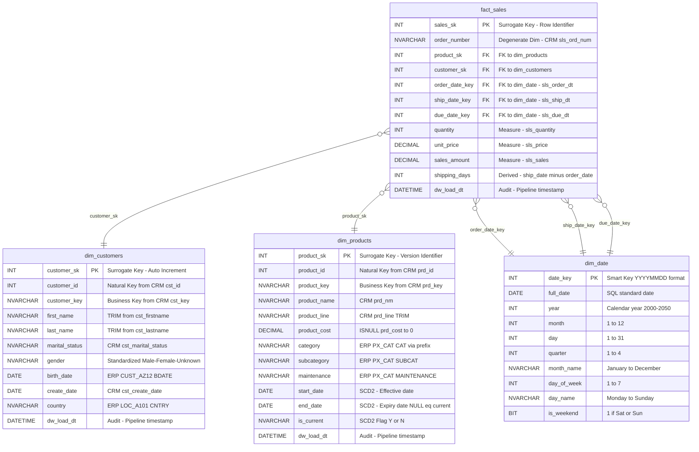

```mermaid
erDiagram
    dim_customers {
        INT customer_sk PK "Surrogate Key - Auto Increment"
        INT customer_id "Natural Key from CRM cst_id"
        NVARCHAR customer_key "Business Key from CRM cst_key"
        NVARCHAR first_name "TRIM from cst_firstname"
        NVARCHAR last_name "TRIM from cst_lastname"
        NVARCHAR marital_status "CRM cst_marital_status"
        NVARCHAR gender "Standardized Male-Female-Unknown"
        DATE birth_date "ERP CUST_AZ12 BDATE"
        DATE create_date "CRM cst_create_date"
        NVARCHAR country "ERP LOC_A101 CNTRY"
        DATETIME dw_load_dt "Audit - Pipeline timestamp"
    }

    dim_products {
        INT product_sk PK "Surrogate Key - Version Identifier"
        INT product_id "Natural Key from CRM prd_id"
        NVARCHAR product_key "Business Key from CRM prd_key"
        NVARCHAR product_name "CRM prd_nm"
        NVARCHAR product_line "CRM prd_line TRIM"
        DECIMAL product_cost "ISNULL prd_cost to 0"
        NVARCHAR category "ERP PX_CAT CAT via prefix"
        NVARCHAR subcategory "ERP PX_CAT SUBCAT"
        NVARCHAR maintenance "ERP PX_CAT MAINTENANCE"
        DATE start_date "SCD2 - Effective date"
        DATE end_date "SCD2 - Expiry date NULL eq current"
        NVARCHAR is_current "SCD2 Flag Y or N"
        DATETIME dw_load_dt "Audit - Pipeline timestamp"
    }

    dim_date {
        INT date_key PK "Smart Key YYYYMMDD format"
        DATE full_date "SQL standard date"
        INT year "Calendar year 2000-2050"
        INT month "1 to 12"
        INT day "1 to 31"
        INT quarter "1 to 4"
        NVARCHAR month_name "January to December"
        INT day_of_week "1 to 7"
        NVARCHAR day_name "Monday to Sunday"
        BIT is_weekend "1 if Sat or Sun"
    }

    fact_sales {
        INT sales_sk PK "Surrogate Key - Row Identifier"
        NVARCHAR order_number "Degenerate Dim - CRM sls_ord_num"
        INT product_sk FK "FK to dim_products"
        INT customer_sk FK "FK to dim_customers"
        INT order_date_key FK "FK to dim_date - sls_order_dt"
        INT ship_date_key FK "FK to dim_date - sls_ship_dt"
        INT due_date_key FK "FK to dim_date - sls_due_dt"
        INT quantity "Measure - sls_quantity"
        DECIMAL unit_price "Measure - sls_price"
        DECIMAL sales_amount "Measure - sls_sales"
        INT shipping_days "Derived - ship_date minus order_date"
        DATETIME dw_load_dt "Audit - Pipeline timestamp"
    }

    fact_sales }o--|| dim_customers : "customer_sk"
    fact_sales }o--|| dim_products : "product_sk"
    fact_sales }o--|| dim_date : "order_date_key"
    fact_sales }o--|| dim_date : "ship_date_key"
    fact_sales }o--|| dim_date : "due_date_key"
```
