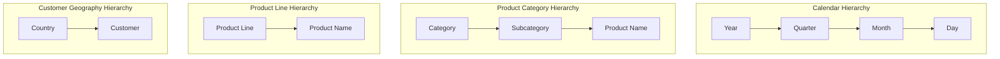

# 🏗️ STAR SCHEMA ERD — DATA WAREHOUSE (Galaxy Schema)

> Thiết kế theo phương pháp luận Kimball Dimensional Modeling.
> **3 Dimension** (Conformed) + **4 Fact** (Transaction / Accumulating / Periodic / Lifetime) + **1 Gold View** (age_band runtime).

```mermaid
erDiagram
    %% ==========================================
    %% DIMENSION TABLES
    %% ==========================================

    dim_customers {
        INT customer_sk PK "Surrogate Key (SCD2 Version)"
        INT customer_id "Natural Key (CRM cst_id)"
        NVARCHAR customer_key "Business Key (AW00011000)"
        NVARCHAR first_name "SCD1: TRIM(cst_firstname)"
        NVARCHAR last_name "SCD1: TRIM(cst_lastname)"
        NVARCHAR full_name "Derived: first + last"
        NVARCHAR marital_status "SCD2: Married/Single/Unknown"
        NVARCHAR gender "SCD1: Male/Female/Unknown"
        DATE birth_date "SCD1: ERP BDATE (filtered)"
        NVARCHAR country "SCD2: Germany/US/Australia/..."
        DATE customer_create_date "CRM cst_create_date"
        DATE scd_start_date "SCD2: Effective From"
        DATE scd_end_date "SCD2: Effective To (NULL=current)"
        NVARCHAR is_current "SCD2 Flag: Y or N"
        DATETIME dw_load_timestamp "Audit: ETL load time"
    }

    dim_products {
        INT product_sk PK "Surrogate Key (SCD2 Version)"
        INT product_id "Natural Key (CRM prd_id)"
        NVARCHAR product_key "Business Key (CO-RF-FR-R92B-58)"
        NVARCHAR product_name "CRM prd_nm"
        NVARCHAR product_line "Road/Mountain/Sport/Touring"
        DECIMAL product_cost "SCD2: COALESCE(prd_cost, 0)"
        NVARCHAR category "ERP CAT: Bikes/Components/..."
        NVARCHAR subcategory "ERP SUBCAT: Road Frames/..."
        NVARCHAR maintenance_flag "ERP: Yes or No"
        DATE scd_start_date "SCD2: prd_start_dt"
        DATE scd_end_date "SCD2: prd_end_dt (NULL=current)"
        NVARCHAR is_current "SCD2 Flag: Y or N"
        DATETIME dw_load_timestamp "Audit: ETL load time"
    }

    dim_date {
        INT date_key PK "Smart Key YYYYMMDD"
        DATE full_date "SQL Standard Date"
        INT year "Calendar Year 2010-2015"
        INT quarter "1-4"
        NVARCHAR quarter_label "Q1 Q2 Q3 Q4"
        INT month "1-12"
        NVARCHAR month_name "January - December"
        NVARCHAR year_month "2011-01 format"
        INT day "1-31"
        INT day_of_week "1(Mon) - 7(Sun)"
        NVARCHAR day_name "Monday - Sunday"
        BIT is_weekend "Flag 1 or 0"
        INT fiscal_year "Fiscal Year"
        INT fiscal_quarter "Fiscal Quarter"
    }

    %% ---- Role-Playing Date Aliases ----
    dim_order_date {
        INT date_key PK "Alias of dim_date for Order"
    }
    dim_ship_date {
        INT date_key PK "Alias of dim_date for Ship"
    }
    dim_due_date {
        INT date_key PK "Alias of dim_date for Due"
    }

    %% ==========================================
    %% GOLD VIEW (Runtime Computed)
    %% ==========================================
    vw_dim_customers_with_age {
        INT customer_sk PK "From dim_customers"
        NVARCHAR age_band "Runtime Calc from birth_date"
    }

    %% ==========================================
    %% FACT TABLES
    %% ==========================================

    %% 1. Transactional Fact (Grain: 1 line item)
    fact_sales_transactions {
        INT sales_fact_sk PK "Surrogate Key"
        NVARCHAR order_number "Degenerate Dim (SO43697)"
        INT customer_sk FK "to dim_customers"
        INT product_sk FK "to dim_products"
        INT order_date_key FK "to dim_date"
        INT ship_date_key FK "to dim_date"
        INT due_date_key FK "to dim_date"
        INT quantity "Measure: Additive"
        DECIMAL unit_price "Measure: Non-additive"
        DECIMAL unit_cost "Measure: From dim_products"
        DECIMAL sales_amount "Measure: qty x price"
        DECIMAL cost_amount "Measure: qty x cost"
        DECIMAL profit_amount "Measure: sales - cost"
        DATETIME dw_load_timestamp "Audit"
    }

    %% 2. Accumulating Snapshot Fact (Grain: 1 order)
    fact_order_fulfillment {
        NVARCHAR order_number PK "Order-level grain"
        INT customer_sk FK "to dim_customers"
        INT order_date_key FK "to dim_date - order"
        INT ship_date_key FK "to dim_date - ship"
        INT due_date_key FK "to dim_date - due"
        INT days_to_ship "Derived: ship - order"
        INT days_shipping_delay "Derived: ship - due"
        BIT is_late_shipment "Flag: 1 if late"
        INT total_line_items "Count of items"
        INT total_quantity "Sum of quantities"
        DECIMAL total_order_amount "Sum of sales"
    }

    %% 3. Periodic Snapshot Fact (Grain: month x product x customer)
    fact_monthly_sales_snapshot {
        INT snapshot_month_key PK_FK "to dim_date EOM"
        INT product_sk PK_FK "to dim_products"
        INT customer_sk PK_FK "to dim_customers"
        DECIMAL monthly_revenue "Aggregated Revenue"
        INT monthly_quantity "Aggregated Quantity"
        INT monthly_order_count "Distinct Order Count"
        DECIMAL monthly_avg_order_value "Derived: rev / count"
    }

    %% 4. Customer Lifetime Fact (Grain: 1 customer)
    fact_customer_lifetime {
        INT customer_sk PK_FK "to dim_customers current"
        INT first_order_date_key FK "to dim_date"
        INT last_order_date_key FK "to dim_date"
        INT customer_lifetime_days "Derived: last - first"
        INT total_orders "Frequency"
        INT total_products_bought "Distinct products"
        DECIMAL lifetime_revenue "Total LTV"
        DECIMAL avg_order_value "Derived: rev / orders"
        NVARCHAR customer_segment "VIP / Regular / Casual"
        INT recency_days "Days since last purchase"
        DATETIME last_calculated_at "Refresh timestamp"
    }

    %% ==========================================
    %% RELATIONSHIPS
    %% ==========================================

    %% Gold View extends dim_customers
    vw_dim_customers_with_age ||--|| dim_customers : "extends with age_band"

    %% Fact 1: Transaction
    fact_sales_transactions }o--|| dim_customers : "purchased by"
    fact_sales_transactions }o--|| dim_products : "contains product"
    fact_sales_transactions }o--|| dim_order_date : "ordered on"
    fact_sales_transactions }o--|| dim_ship_date : "shipped on"
    fact_sales_transactions }o--|| dim_due_date : "due on"

    %% Fact 2: Fulfillment (Accumulating Snapshot)
    fact_order_fulfillment }o--|| dim_customers : "placed by"
    fact_order_fulfillment }o--|| dim_order_date : "ordered on"
    fact_order_fulfillment }o--|| dim_ship_date : "shipped on"
    fact_order_fulfillment }o--|| dim_due_date : "due on"

    %% Fact 3: Monthly Snapshot
    fact_monthly_sales_snapshot }o--|| dim_products : "product summary"
    fact_monthly_sales_snapshot }o--|| dim_customers : "customer summary"
    fact_monthly_sales_snapshot }o--|| dim_date : "end of month"

    %% Fact 4: Customer Lifetime
    fact_customer_lifetime ||--|| dim_customers : "extends profile"
    fact_customer_lifetime }o--|| dim_date : "first purchase"
    fact_customer_lifetime }o--|| dim_date : "last purchase"

    %% Role-Playing Aliases
    dim_order_date ||--|| dim_date : "alias"
    dim_ship_date ||--|| dim_date : "alias"
    dim_due_date ||--|| dim_date : "alias"
```

---

## 📊 Hierarchy Summary



---

## 🔄 SCD Strategy Summary

| Dimension | Attribute | SCD Type | Rationale |
|-----------|-----------|----------|-----------|
| `dim_customers` | first_name, last_name, full_name | **Type 1** | Typo fix, no history needed |
| `dim_customers` | gender, birth_date | **Type 1** | Demographic data, fix-only |
| `dim_customers` | marital_status | **Type 2** | Impacts purchase behavior analysis |
| `dim_customers` | country | **Type 2** | Geographic shift changes regional analysis |
| `dim_products` | product_name, category, subcategory | **Type 1** | Descriptive, always want latest |
| `dim_products` | product_cost | **Type 2** | Source has native price history (start/end dt) |
| Gold View | age_band | **Runtime** | Computed from birth_date at query time |
